# InterviewAI 🚀

### 🌐 Live Demo
**https://interviewai-frontend-3c4x.onrender.com**

> **Note:** This application is hosted on Render's free tier. The initial load may take 30–60 seconds if the server is waking up after a period of inactivity.

---

## 📌 About

InterviewAI is an AI-powered interview preparation platform built using the **MERN Stack (MongoDB, Express.js, React.js, and Node.js)**, **Tailwind CSS**, the **Gemini API**, and **Puppeteer**. It helps job seekers evaluate their resumes against job descriptions, generate personalized interview questions, and follow a customized preparation roadmap to improve their interview readiness.

---

## ✨ Features

- 📄 **Resume Evaluation**
  - Upload a resume and compare it against a target job description.
  - Receive an AI-generated resume match score with detailed feedback.

- 🤖 **AI-Generated Interview Questions**
  - Generates personalized behavioural and technical interview questions based on the uploaded resume and job description.

- 🗓 **10-Day Preparation Roadmap**
  - Creates a customized day-wise roadmap highlighting topics to focus on before the interview.

- 📑 **Resume PDF Generation**
  - Generates a professionally formatted downloadable resume PDF using **Puppeteer**.

- 📊 **Preparation Dashboard**
  - Stores previous interview preparation sessions, allowing users to revisit their preparation history.

- 🔐 **Secure Authentication**
  - User registration and login for a personalized experience.

- 📱 **Responsive User Interface**
  - Built using **React.js** and **Tailwind CSS** for a seamless experience across devices.

---

## 🛠 Tech Stack

| Category | Technologies |
|----------|--------------|
| **Frontend** | React.js, Tailwind CSS, HTML5, CSS3, JavaScript |
| **Backend** | Node.js, Express.js |
| **Database** | MongoDB |
| **AI Integration** | Gemini API |
| **Libraries & Tools** | Puppeteer, Git, GitHub |

---

## 🔄 Project Workflow

1. User signs in to the platform.
2. Uploads a resume and enters a self-description.
3. Pastes the target job description.
4. The **Gemini API** analyzes the resume against the job description.
5. The platform generates:
   - Resume match score
   - Resume feedback
   - Behavioural interview questions
   - Technical interview questions
   - Personalized 10-day interview preparation roadmap
6. Users can download a professionally formatted resume PDF.
7. Every preparation session is saved in the dashboard for future reference.

---

## 📸 Screenshots

### 🔐 Authentication

#### Login Page
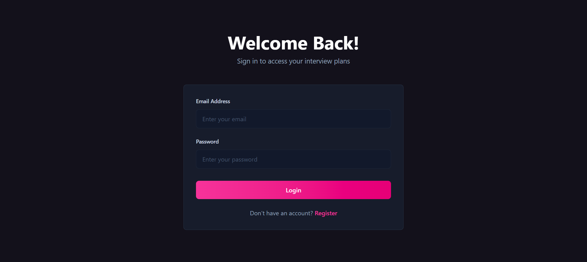

#### Registration Page
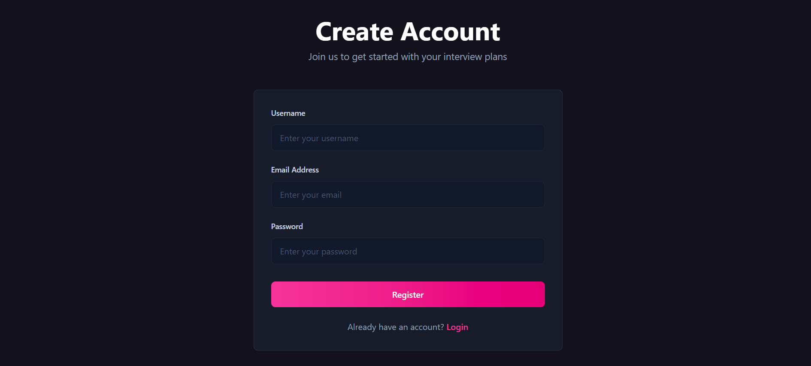

---

### 🏠 User Dashboard

#### Dashboard Overview
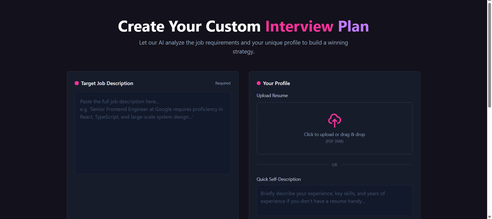

#### Dashboard Details
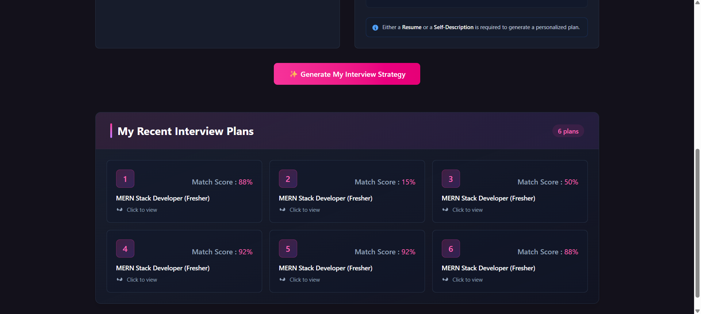

---

### 🤖 AI Resume Generation

#### AI-Generated Resume PDF
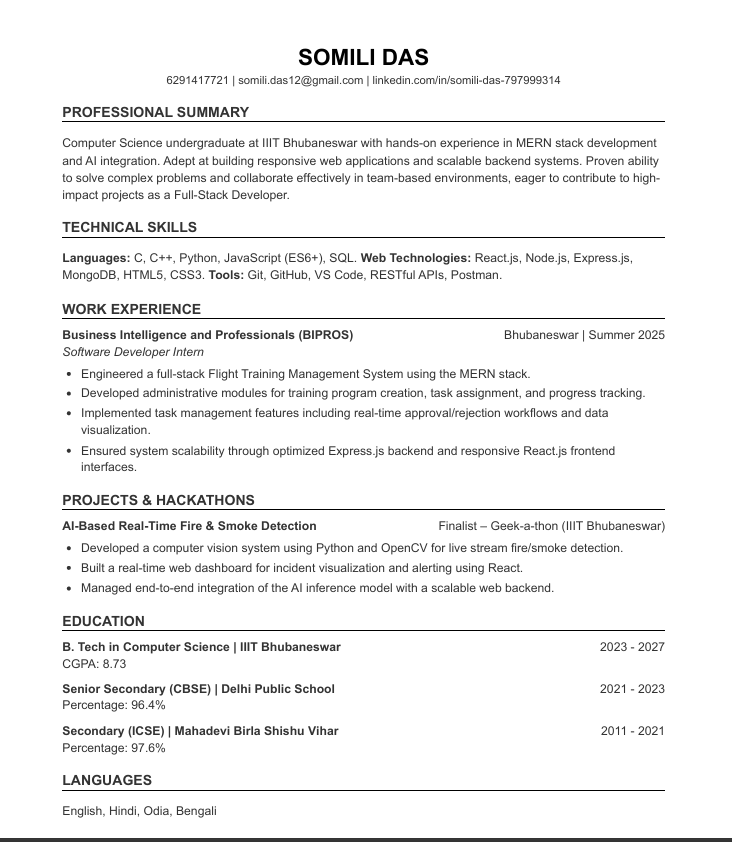

---

### 💬 AI Interview Preparation

#### Behavioural Interview Questions
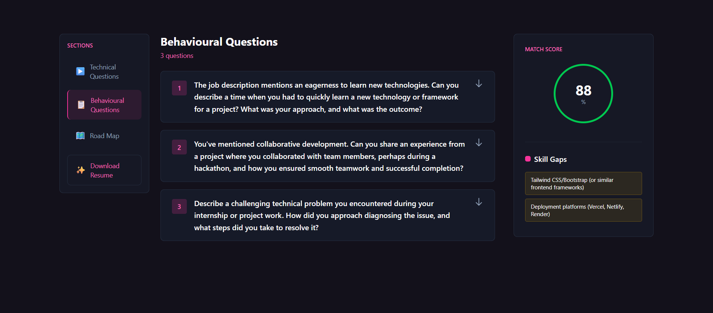

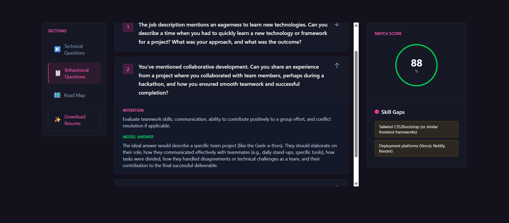

#### Technical Interview Questions
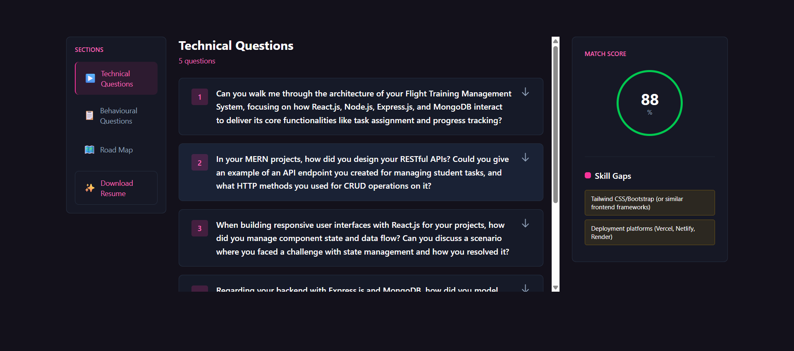

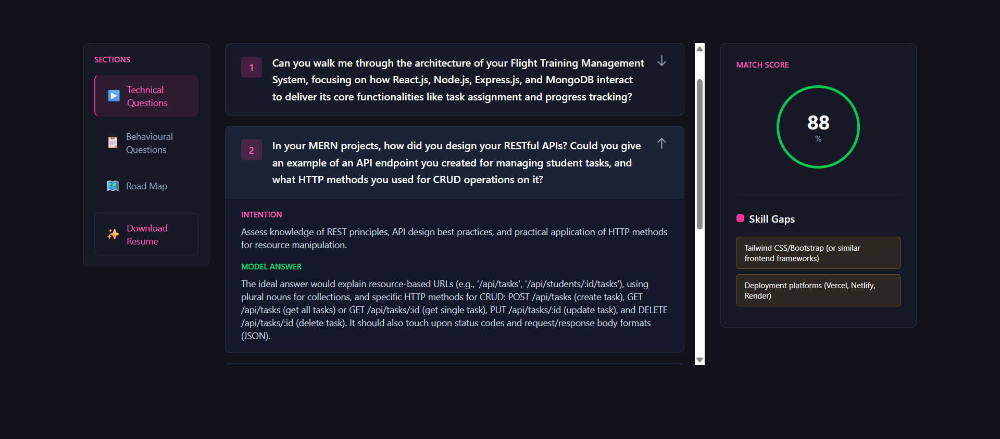

---

### 🗺️ Preparation Roadmap

#### 10-Day Interview Preparation Roadmap
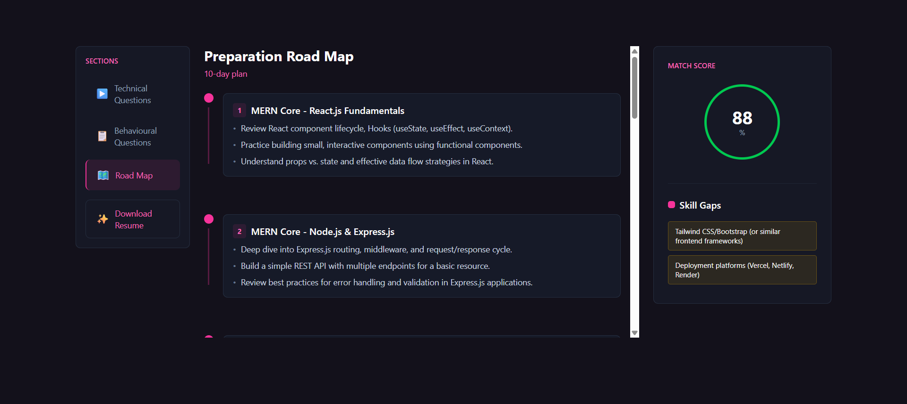

---

### ⏳ Loading Screen

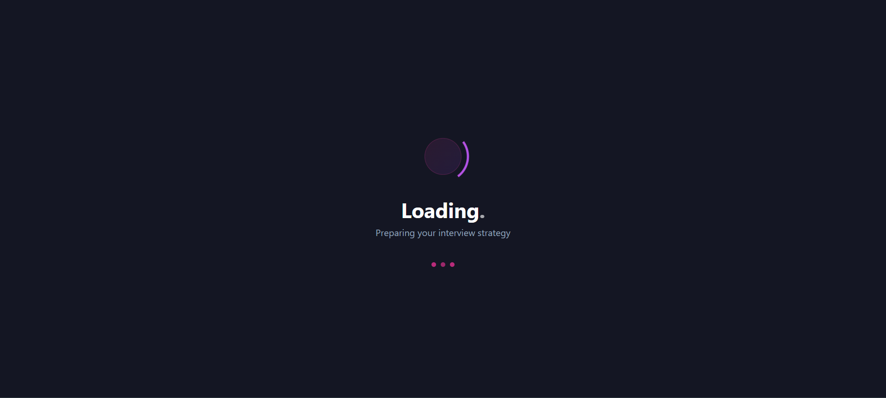

---

## 🚀 Future Enhancements

- AI-powered mock interviews with voice interaction
- AI feedback on interview responses
- Company-specific interview preparation
- Multiple resume templates
- ATS keyword optimization
- Email reports and interview reminders

---

## 👩‍💻 Author

**Somili Das**

- GitHub: https://github.com/SomiliDas
- LinkedIn: https://linkedin.com/in/somili-das-797999314

---

⭐ **If you found this project interesting, consider giving it a star!**
